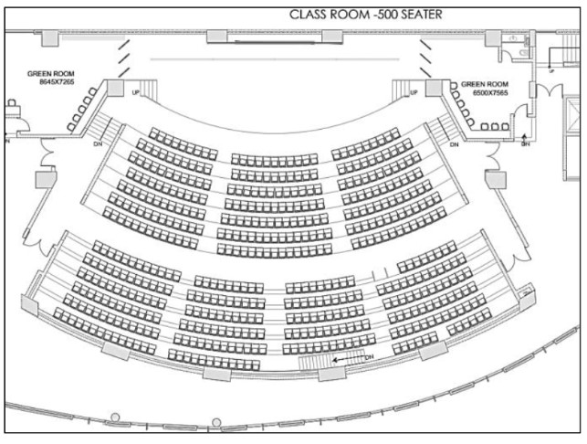
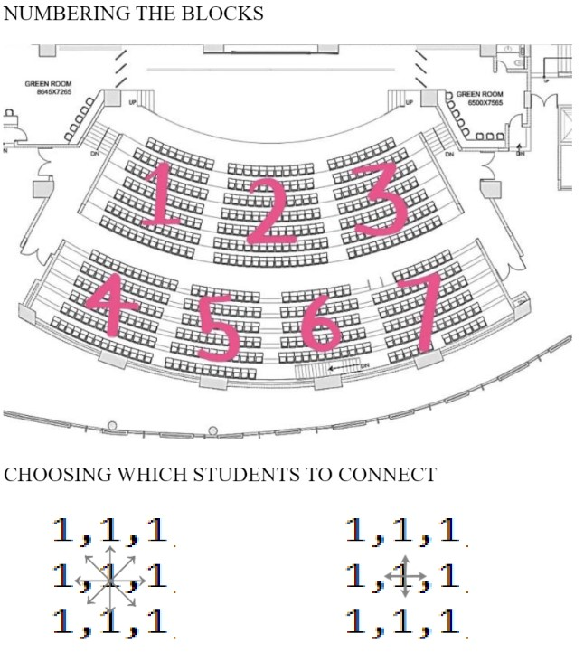

## Exam Paper Distribution Simulation for Fairness📝

    <b><u>Lecture Hall: </u></b>  
    

## BFS Function 🚀

  

This C++ program simulates the distribution of papers by students in a grid, represented as blocks using a 2D vector. The simulation employs a breadth-first search (BFS) algorithm, where students distribute papers in different directions (4 and 8 directional) until reaching the boundary.

    <b><u>Lecture Hall: </u></b>  
    

### BFS Loop 🔍

  

- The function enters a while loop, which continues until the queue is empty.

- Within the loop, the front element of the queue (current) is popped.

- The current time is updated based on the time taken to reach the current cell.

  

### Neighbouring Cells Exploration 🌐

  

- The function explores the neighbouring cells of the current cell in eight possible directions.

- For each neighbour, it checks conditions such as movement within grid boundaries, the absence of blockage (`graph[nx][ny] == 1`), and unvisited status (`!visited[nx][ny]`).

- If conditions are met, the neighbour is pushed onto the queue with an updated time (`currentTime + 1`), and the neighbour cell is marked as visited.

  

### Time Tracking ⏱️

- The `totalTime` is updated to keep track of the maximum time encountered during the BFS traversal.

  

### Time taken if movement in Diagonal Directions is allowed 🔄

  

- To calculate time with diagonal movement, modify the for loop in the BFS function by replacing `4` with `8`. This ensures the updated time is calculated using all eight directions.

